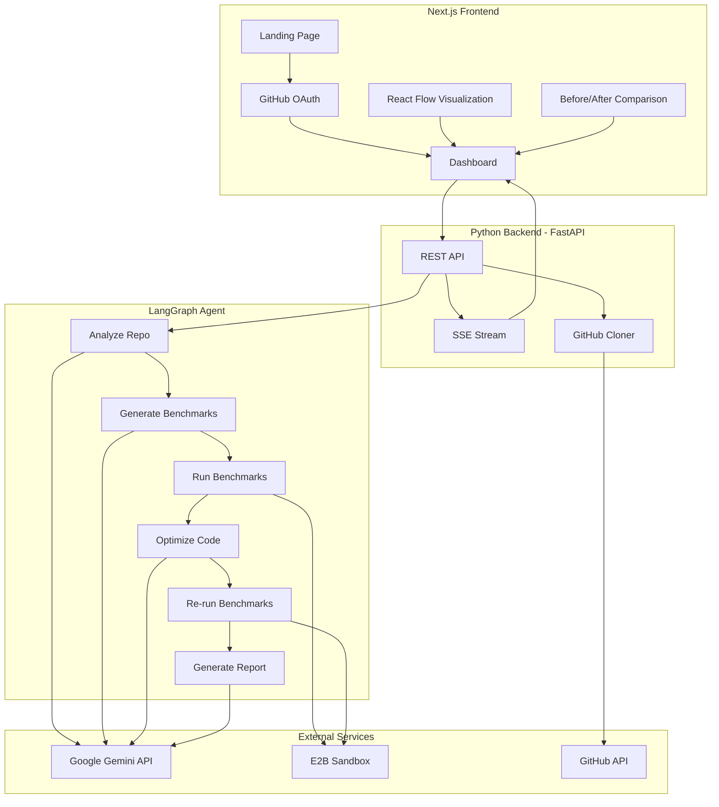
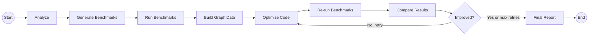

# Performance Optimizer - Hackathon Project Plan

## Architecture Overview




## Tech Stack

- **Frontend**: Next.js 14 (App Router), Tailwind CSS, shadcn/ui, React Flow (for performance graph visualization)
- **Backend**: Python, FastAPI, LangGraph, `google-genai` SDK
- **Code Execution**: E2B sandboxes (safe cloud execution for benchmarks)
- **Auth**: NextAuth.js with GitHub OAuth provider
- **Real-time Updates**: Server-Sent Events (SSE) from FastAPI to frontend
- **Repo Handling**: GitHub REST API via PyGithub + git clone

## Directory Structure

```
genai-genisis/
  frontend/              # Next.js app
    src/
      app/
        page.tsx           # Landing page
        dashboard/
          page.tsx         # Main dashboard after login
        api/
          auth/[...nextauth]/route.ts  # NextAuth GitHub OAuth
      components/
        repo-input.tsx     # GitHub URL input form
        performance-graph.tsx  # React Flow visualization
        comparison-view.tsx    # Before/after side-by-side
        status-stream.tsx      # Real-time agent progress
      lib/
        api.ts             # Backend API client
  backend/               # Python FastAPI
    main.py              # FastAPI app, routes, SSE endpoint
    agent/
      graph.py           # LangGraph agent definition
      nodes/
        analyzer.py      # Analyze repo structure and hotspots
        benchmarker.py   # Generate benchmark code
        runner.py        # Execute benchmarks in E2B
        optimizer.py     # Generate optimized code via Gemini
        reporter.py      # Compile results into visualization data
    services/
      github_service.py  # Clone repos, read files, create branches
      e2b_service.py     # E2B sandbox management
      gemini_service.py  # Gemini API wrapper
    requirements.txt
  .env                   # API keys (GOOGLE_API_KEY, E2B_API_KEY, GITHUB_*)
```

## LangGraph Agent Design

The agent follows a sequential pipeline with a conditional optimization loop:




**Agent State** (shared across all nodes):

- `repo_url`, `repo_path` (cloned location)
- `file_tree` (structure of the repo)
- `analysis` (identified modules, dependencies, hotspot candidates)
- `benchmark_code` (generated performance test scripts)
- `initial_results` (timing/profiling data from first run)
- `graph_data` (nodes + edges for React Flow visualization)
- `optimized_files` (dict of filepath -> optimized content)
- `final_results` (timing/profiling data after optimization)
- `comparison` (structured before/after delta)
- `messages` (progress messages streamed to frontend via SSE)

**Node Details**:

1. **Analyzer** - Uses Gemini to read the repo's file tree + key files, identify modules, dependencies between them, and likely performance bottlenecks (N+1 queries, blocking I/O, inefficient algorithms, etc.)
2. **Benchmark Generator** - Gemini generates benchmark scripts (Python: `timeit`/`cProfile`; JS/TS: `perf_hooks`/custom timing) targeting the identified hotspots
3. **Benchmark Runner** - Executes the benchmarks inside an E2B sandbox, captures stdout/timing data
4. **Visualizer** - Transforms analysis + benchmark results into React Flow graph data (nodes = modules/functions, edges = call relationships, node color/size = performance metrics)
5. **Optimizer** - Gemini rewrites the bottleneck code with optimizations (algorithm improvements, async I/O, batch API calls, caching, compiler hints, etc.)
6. **Re-runner** - Runs the same benchmarks on the optimized code in E2B
7. **Reporter** - Computes deltas, generates the comparison visualization data

## Frontend Key Screens

### 1. Landing Page

- Hero section explaining the tool
- "Sign in with GitHub" button (NextAuth)

### 2. Dashboard

- Input field for GitHub repo URL
- "Analyze" button to kick off the pipeline
- Real-time status feed (SSE) showing which agent step is running
- **Performance Graph** (React Flow): interactive node graph where each node is a module/function, edges are call relationships, and node color indicates performance (green = fast, red = bottleneck). Clicking a node shows details.
- **Before/After Comparison**: side-by-side bar charts or metrics cards showing timing improvements per module

## API Endpoints (FastAPI)

- `POST /api/analyze` - accepts `{ repo_url, github_token }`, kicks off the LangGraph agent, returns a `job_id`
- `GET /api/stream/{job_id}` - SSE endpoint streaming real-time progress and results
- `GET /api/results/{job_id}` - fetch final results (graph data, comparison, optimized files)

## Key Implementation Notes

- **GitHub OAuth flow**: NextAuth handles the OAuth on the frontend; the access token is forwarded to the backend so it can clone private repos
- **E2B Sandbox**: Each benchmark run spins up a fresh E2B sandbox with the appropriate runtime (Python 3.x or Node.js). The repo code + benchmark scripts are uploaded, executed, and results are pulled back. This keeps execution safe and isolated.
- **Streaming UX**: SSE is simpler than WebSockets for this uni-directional update pattern. Each LangGraph node emits status messages that flow through FastAPI's SSE endpoint to the frontend.
- **Supported languages**: Python and JavaScript/TypeScript. The Analyzer node detects the language from the repo and tailors the benchmark generation accordingly.
- **Gemini model**: Use `gemini-2.5-pro` for the complex analysis/optimization nodes (good at code understanding), and `gemini-2.0-flash` for lighter tasks like status summaries.

