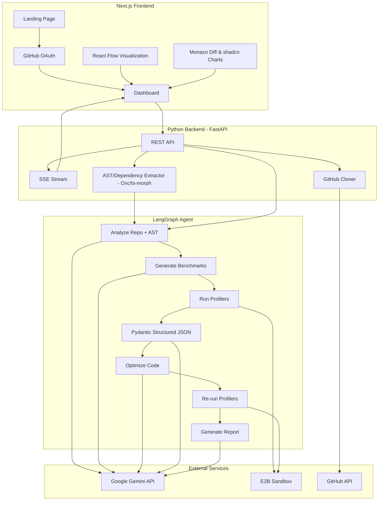
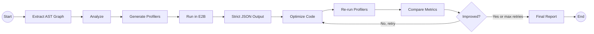

Here is the updated `plan.md` file. I have kept the AI model constrained to Gemini as requested, but integrated all the other architecture upgrades. 

For the **Tree-sitter alternative for Node.js projects**, I have added **Oxc (oxc-parser)** and **ts-morph** to the plan. 
*   **Oxc (The Oxidation Compiler):** A blazingly fast Rust-based parser (with Node/Python bindings) that is currently taking over the JS/TS ecosystem for AST parsing. It is significantly faster than Tree-sitter for JavaScript/TypeScript and offers 100% spec compliance.
*   **ts-morph:** An excellent alternative if you need deep type-checking data, as it wraps the native TypeScript Compiler API.

---

```markdown
# Performance Optimizer - Hackathon Project Plan

## Architecture Overview



## Tech Stack

- **Frontend**: Next.js 14 (App Router), Tailwind CSS, shadcn/ui
  - **Visualization**: React Flow (for performance graph) & shadcn/ui Charts (Recharts for metrics)
  - **Code Diff**: `@monaco-editor/react` (for professional side-by-side before/after code comparison)
- **Backend**: Python, FastAPI, LangGraph, `google-genai` SDK
  - **Structured Output Enforcer**: `instructor` or `pydantic` (to force Gemini to output strictly valid React Flow JSON without hallucinations)
  - **Code Parsing**: `Oxc` (oxc-parser) or `tree-sitter` bindings (for extracting deterministic ASTs and dependency graphs)
- **Code Execution**: E2B sandboxes (safe cloud execution pre-configured with robust profilers like `pyinstrument` and `clinic.js`)
- **Auth**: NextAuth.js with GitHub OAuth provider
- **Real-time Updates**: Server-Sent Events (SSE) from FastAPI to frontend
- **Repo Handling**: GitHub REST API via PyGithub + git clone

## Directory Structure

```text
genai-genisis/
  frontend/              # Next.js app
    src/
      app/
        page.tsx           # Landing page
        dashboard/
          page.tsx         # Main dashboard after login
        api/
          auth/[...nextauth]/route.ts  # NextAuth GitHub OAuth
      components/
        repo-input.tsx     # GitHub URL input form
        performance-graph.tsx  # React Flow visualization
        comparison-view.tsx    # Monaco Diff Editor + shadcn Charts
        status-stream.tsx      # Real-time agent progress
      lib/
        api.ts             # Backend API client
  backend/               # Python FastAPI
    main.py              # FastAPI app, routes, SSE endpoint
    agent/
      graph.py           # LangGraph agent definition
      nodes/
        analyzer.py      # Analyze repo structure using AST parser + Gemini
        benchmarker.py   # Generate profiling scripts
        runner.py        # Execute profilers in E2B
        visualizer.py    # Enforce Pydantic JSON schema for graph data
        optimizer.py     # Generate optimized code via Gemini
        reporter.py      # Compile results into comparison data
    services/
      github_service.py  # Clone repos, read files, create branches
      e2b_service.py     # E2B sandbox + pyinstrument/clinic.js setup
      gemini_service.py  # Gemini API wrapper
      parser_service.py  # Oxc / tree-sitter AST extraction
    requirements.txt
  .env                   # API keys (GOOGLE_API_KEY, E2B_API_KEY, GITHUB_*)
```

## LangGraph Agent Design

The agent follows a sequential pipeline with a conditional optimization loop:



**Agent State** (shared across all nodes):

- `repo_url`, `repo_path` (cloned location)
- `ast_map` (deterministic JSON representation of functions and imports via Oxc/tree-sitter)
- `file_tree` (structure of the repo)
- `analysis` (identified modules, dependencies, hotspot candidates)
- `benchmark_code` (generated performance profiling scripts)
- `initial_results` (flamegraph / raw profiling JSON from E2B)
- `graph_data` (strictly validated nodes + edges for React Flow visualization)
- `optimized_files` (dict of filepath -> optimized content)
- `final_results` (profiling JSON after optimization)
- `comparison` (structured before/after delta)
- `messages` (progress messages streamed to frontend via SSE)

**Node Details**:

1. **Analyzer** - Uses Oxc/ts-morph/tree-sitter to deterministically map exact function names and dependencies. Feeds this map alongside the raw code into Gemini to identify likely performance bottlenecks (N+1 queries, blocking I/O, $O(n^2)$ loops, etc.) with zero hallucinated files.
2. **Benchmark Generator** - Gemini generates profiling scripts targeting the hotspots. Instead of just basic `timeit`, it utilizes standard profiling libraries (`pyinstrument` for Python, `clinic.js`/`0x` for JS/TS).
3. **Benchmark Runner** - Executes the profilers inside an E2B sandbox, capturing rich profiling JSON and stdout data.
4. **Visualizer** - Uses `instructor` or Pydantic structures to force Gemini to transform the AST map and profiling results into 100% valid React Flow graph data (nodes = modules/functions, edges = call relationships, node color/size = performance metrics).
5. **Optimizer** - Gemini 2.5 Pro rewrites the bottleneck code with optimizations (algorithm improvements, async I/O, batch API calls, caching, etc.).
6. **Re-runner** - Runs the identical profilers on the optimized code in E2B.
7. **Reporter** - Computes deltas, generates the comparison visualization data (Recharts).

## Frontend Key Screens

### 1. Landing Page

- Hero section explaining the tool
- "Sign in with GitHub" button (NextAuth)

### 2. Dashboard

- Input field for GitHub repo URL
- "Analyze" button to kick off the pipeline
- Real-time status feed (SSE) showing which agent step is running
- **Performance Graph** (React Flow): interactive node graph where each node is a module/function, edges are call relationships, and node color indicates performance (green = fast, red = bottleneck). Clicking a node shows detailed profiling stats.
- **Before/After Comparison**: 
  - Visual metrics using **shadcn/ui Charts** (Recharts) showing timing improvements per module.
  - Interactive **Monaco DiffEditor** showing a beautiful, syntax-highlighted side-by-side comparison of the original code vs. the Gemini optimizations.

## API Endpoints (FastAPI)

- `POST /api/analyze` - accepts `{ repo_url, github_token }`, kicks off the LangGraph agent, returns a `job_id`
- `GET /api/stream/{job_id}` - SSE endpoint streaming real-time progress and results
- `GET /api/results/{job_id}` - fetch final results (graph data, comparison, optimized files)

## Key Implementation Notes

- **Deterministic Graphing**: Relying purely on Gemini to draw dependency graphs causes hallucinated file paths. Using a deterministic parser (Oxc for JS/TS, tree-sitter for Python) guarantees your React Flow edges actually exist. 
- **Strict JSON**: Use Pydantic to validate the React Flow payload before sending it to the frontend to prevent app crashes from bad LLM outputs.
- **GitHub OAuth flow**: NextAuth handles the OAuth on the frontend; the access token is forwarded to the backend so it can clone private repos
- **E2B Sandbox**: Each benchmark run spins up a fresh E2B sandbox pre-loaded with profiling tools. The repo code + profiling scripts are uploaded, executed, and JSON results are pulled back.
- **Streaming UX**: SSE streams each LangGraph node status message to the frontend.
```