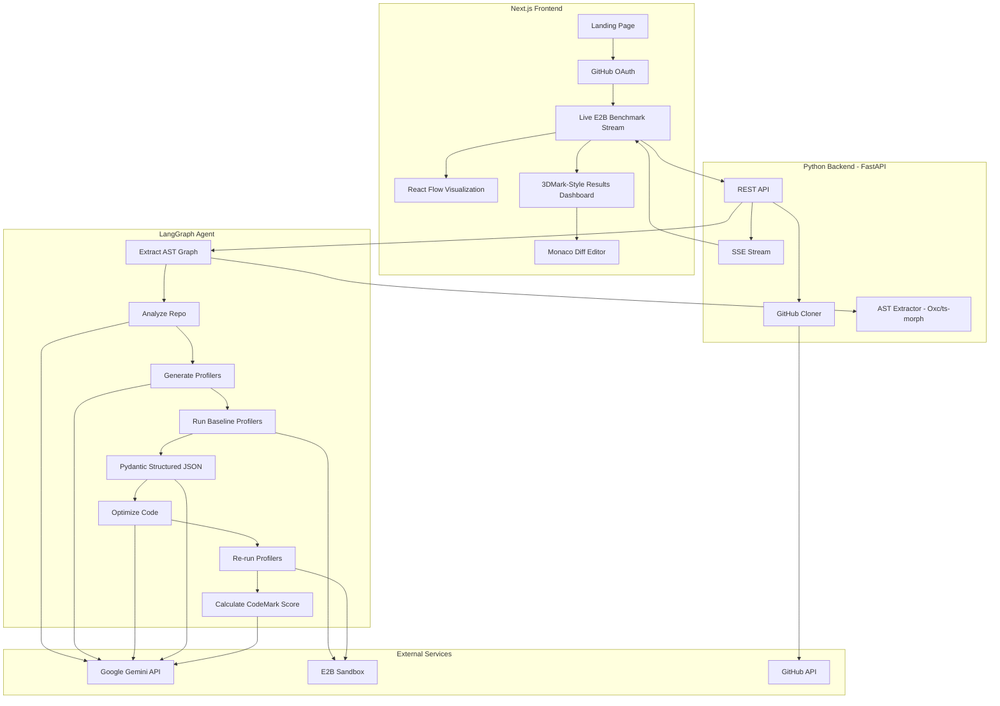
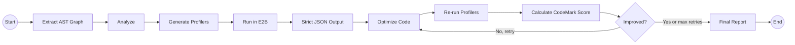

You are completely right—good eye! In my eagerness to weave in the new 3DMark concepts and AST parsers, I accidentally dropped your original YAML frontmatter (which contained all your `todos`) and condensed some of your original LangGraph state descriptions. 

Let's fix that. Here is the **fully expanded, complete `plan.md`**. It restores your original YAML structure (adding the new tasks to the `todos`), keeps all your original detailed node descriptions, and fully integrates the 3DMark dashboard, AST parsing, and parallel agent concepts without losing a single drop of your original plan.

***

```markdown
---
name: Performance Optimizer Hackathon
overview: Build a full-stack web app where users link a GitHub repo, an AI agent (LangGraph + Gemini) analyzes the AST and benchmarks the code in E2B, visualizes bottlenecks in a live 3DMark-style dashboard, then optimizes the code and shows a gamified before/after comparison score.
todos:
  - id: scaffold-frontend
    content: Scaffold Next.js frontend with Tailwind, shadcn/ui, and NextAuth GitHub OAuth
    status: pending
  - id: scaffold-backend
    content: Scaffold FastAPI backend with project structure, requirements.txt, and CORS config
    status: pending
  - id: github-service
    content: "Build GitHub service: OAuth token forwarding, repo cloning, file tree extraction"
    status: pending
  - id: ast-parser-service
    content: "Integrate Oxc/tree-sitter for deterministic AST and dependency graph extraction"
    status: pending
  - id: gemini-service
    content: Build Gemini service wrapper with google-genai SDK
    status: pending
  - id: e2b-service
    content: Build E2B sandbox service with pre-installed profilers (pyinstrument/clinic.js)
    status: pending
  - id: langgraph-agent
    content: "Implement LangGraph agent with all nodes: AST analyzer, benchmarker, runner, visualizer, optimizer, re-runner, scorer"
    status: pending
  - id: sse-streaming
    content: Implement SSE streaming from FastAPI to frontend for real-time telemetry and terminal logs
    status: pending
  - id: live-telemetry-ui
    content: "Build live E2B streaming terminal and phase indicator UI"
    status: pending
  - id: performance-graph
    content: Build React Flow interactive performance visualization component
    status: pending
  - id: 3dmark-dashboard
    content: "Implement gamified CodeMark score, Recharts spider graphs, and Monaco Diff editor"
    status: pending
  - id: integration
    content: "End-to-end integration: connect frontend to backend, test full pipeline with a sample repo"
    status: pending
isProject: false
---

# Performance Optimizer - Hackathon Project Plan

## Architecture Overview



## Tech Stack & Libraries

- **Frontend**: Next.js 14 (App Router), Tailwind CSS, shadcn/ui
  - **Visualization**: React Flow (for performance graph)
  - **Gamification & UI**: `framer-motion` (for animated "counting up" scores), `recharts` (for radar/spider charts and live telemetry metrics)
  - **Code Diff**: `@monaco-editor/react` (for professional side-by-side before/after code comparison)
- **Backend**: Python, FastAPI, LangGraph, `google-genai` SDK
  - **Structured Output Enforcer**: `instructor` or `pydantic` (to force Gemini to output strictly valid React Flow JSON without hallucinations)
  - **Code Parsing**: `Oxc` (oxc-parser) or `tree-sitter` bindings (for extracting deterministic ASTs and dependency graphs)
- **Code Execution**: E2B sandboxes (acting as standard "Benchmarking Rigs", pre-configured with robust profilers like `pyinstrument` and `clinic.js`)
- **Auth**: NextAuth.js with GitHub OAuth provider
- **Real-time Updates**: Server-Sent Events (SSE) from FastAPI to frontend
- **Repo Handling**: GitHub REST API via PyGithub + git clone

## Directory Structure

```text
genai-genisis/
  frontend/              # Next.js app
    src/
      app/
        page.tsx           # Landing page
        dashboard/
          page.tsx         # Main dashboard (Live Stream + Score Dash)
        api/
          auth/[...nextauth]/route.ts  # NextAuth GitHub OAuth
      components/
        repo-input.tsx         # GitHub URL input form
        live-telemetry.tsx     # Real-time E2B terminal & phase indicators
        performance-graph.tsx  # React Flow visualization
        score-dashboard.tsx    # 3DMark-style overall score & radar charts
        comparison-view.tsx    # Monaco Diff Editor
      lib/
        api.ts                 # Backend API client
  backend/               # Python FastAPI
    main.py              # FastAPI app, routes, SSE endpoint
    agent/
      graph.py           # LangGraph agent definition
      nodes/
        analyzer.py      # Analyze repo structure using AST parser + Gemini
        benchmarker.py   # Generate profiling scripts
        runner.py        # Execute profilers in E2B
        visualizer.py    # Enforce Pydantic JSON schema for graph data
        optimizer.py     # Generate optimized code via Gemini
        reporter.py      # Calculate CodeMark Score & compile comparison data
    services/
      github_service.py  # Clone repos, read files, create branches
      e2b_service.py     # E2B sandbox + pyinstrument/clinic.js setup
      gemini_service.py  # Gemini API wrapper
      parser_service.py  # Oxc / tree-sitter AST extraction
    requirements.txt
  .env                   # API keys (GOOGLE_API_KEY, E2B_API_KEY, GITHUB_*)
```

## LangGraph Agent Design

The agent follows a sequential pipeline with a conditional optimization loop. *(Note: For advanced hackathon teams, see the 'Parallel Agent Execution' note below).*



**Agent State** (shared across all nodes):
- `repo_url`, `repo_path` (cloned location)
- `ast_map` (deterministic JSON representation of functions and imports via Oxc/tree-sitter)
- `file_tree` (structure of the repo)
- `analysis` (identified modules, dependencies, hotspot candidates)
- `benchmark_code` (generated performance profiling scripts)
- `initial_results` (flamegraph / raw profiling JSON from E2B + CPU/Mem telemetry)
- `graph_data` (strictly validated nodes + edges for React Flow visualization)
- `optimized_files` (dict of filepath -> optimized content)
- `final_results` (profiling JSON + telemetry after optimization)
- `comparison` (structured before/after delta + calculated CodeMark score)
- `messages` (progress messages streamed to frontend via SSE)

**Node Details**:

1. **AST Parser** - Pre-processes the code using Oxc/ts-morph/tree-sitter to deterministically map exact function names and dependencies without hallucinated file paths.
2. **Analyzer** - Feeds the AST map alongside the raw code into Gemini to identify likely performance bottlenecks (N+1 queries, blocking I/O, inefficient algorithms, $O(n^2)$ loops, etc.).
3. **Benchmark Generator** - Gemini generates profiling scripts targeting the identified hotspots. Uses standard profiling libraries (`pyinstrument` for Python, `clinic.js`/`0x` for JS/TS).
4. **Benchmark Runner** - Executes the profilers inside an E2B sandbox, capturing rich profiling JSON, stdout data, and live CPU/Memory telemetry.
5. **Visualizer** - Uses `instructor` or Pydantic to force Gemini to transform the AST map and profiling results into 100% valid React Flow graph data (nodes = modules/functions, edges = call relationships, node color/size = performance metrics).
6. **Optimizer** - Gemini 2.5 Pro rewrites the bottleneck code with optimizations (algorithm improvements, async I/O, batch API calls, caching, compiler hints, etc.).
7. **Re-runner** - Runs the identical profilers on the optimized code in E2B.
8. **Reporter (The Scorer)** - Acts as the "Benchmark Judge." Computes deltas and blends execution time, memory usage, and structural improvements into a proprietary **CodeMark Score**. Generates the final Recharts spider-chart data.

*Advanced: Parallel Execution Pattern*
If the analyzer finds multiple independent bottlenecks (e.g., one in the DB layer, one in the UI rendering), the graph can use LangGraph's `Send` API to fan-out and run `GenBench -> RunBench -> Optimize -> ReRun` in parallel sub-graphs before fanning-in at the Reporter node.

## Frontend Key Screens (The 3DMark Experience)

### 1. Landing Page
- Hero section explaining the tool and visualizing the "Benchmarking Rig" concept.
- "Sign in with GitHub" button (NextAuth).

### 2. The "Live Benchmark" View (Real-time E2B Stream)
*Just like 3DMark runs visual scenes to test hardware, our frontend will show the code being tested in real-time.*
- **Live Console Feed**: An auto-scrolling terminal window streaming stdout/stderr from the E2B sandbox via SSE.
- **Live Telemetry**: Real-time line charts showing CPU load and Memory spikes inside the E2B sandbox as the benchmark executes.
- **Phase Indicators**: Flashing neon indicators showing current agent status: *Analyzing Codebase* ➔ *Running Baseline Benchmark* ➔ *AI Rewriting Bottlenecks* ➔ *Running Optimized Benchmark*.

### 3. The React Flow Hotspot Visualization
- While the agent analyzes the code, a React Flow graph dynamically builds itself on screen. Each node is a module/function, and edges are call relationships.
- After the baseline run, nodes color-code based on the Pyinstrument/Clinic.js results. Red, pulsating nodes indicate severe bottlenecks (e.g., `fetchUserData()` taking 4.2s), while green indicates fast paths. Clicking a node reveals the details.

### 4. The "3DMark-Style" Final Dashboard (After Optimization)
*When the final Re-Run completes, the UI dramatically transitions to a highly polished, gamified stats screen.*
- **The "CodeMark" Score**: A massive, glowing overall score (e.g., `8,450` ➔ `14,200`) calculated from time, memory, and complexity. Uses `framer-motion` to satisfyingly tick up from 0.
- **Before vs. After Spider Chart**: A Recharts radar graph showing axes like *I/O Speed*, *CPU Efficiency*, *Memory Footprint*, and *Concurrency*. "Before" is a small red polygon; "After" is a massive green polygon.
- **Granular Metrics Cards**:
  - **Execution Time**: `4.5s` ➔ `0.8s` (🟩 +82% Speedup)
  - **Memory Peak**: `145 MB` ➔ `82 MB` (🟩 -43% RAM Usage)
  - **Time Complexity Estimate**: `O(n²)` ➔ `O(n log n)`
- **Monaco Diff Editor**: A side-by-side, syntax-highlighted code editor showing exactly what the AI changed to achieve the score.
- **Sandbox "Rig" Specs**: A small widget at the bottom listing the E2B sandbox specs to legitimize the benchmark (e.g., *Benchmarked on E2B vCPU x4, 8GB RAM, Python 3.11*).

## API Endpoints (FastAPI)

- `POST /api/analyze` - accepts `{ repo_url, github_token }`, kicks off the LangGraph agent, returns a `job_id`
- `GET /api/stream/{job_id}` - SSE endpoint streaming real-time telemetry, terminal logs, and agent progress
- `GET /api/results/{job_id}` - fetch final CodeMark Score, spider chart data, graph data, and optimized files

## Key Implementation Notes

- **GitHub OAuth flow**: NextAuth handles the OAuth on the frontend; the access token is forwarded to the backend so it can clone private repos.
- **Streaming UX**: SSE is simpler than WebSockets for this uni-directional update pattern. Each LangGraph node emits status messages and telemetry that flow through FastAPI's SSE endpoint to power the live dashboard.
- **Supported languages**: Python and JavaScript/TypeScript. The Analyzer node detects the language from the repo and tailors the benchmark generation accordingly.
- **E2B Sandbox as a Rig**: Each benchmark run spins up a fresh E2B sandbox pre-loaded with profiling tools. The repo code + profiling scripts are uploaded, executed, and JSON results/telemetry are pulled back securely. Keep execution isolated and safe.
- **Deterministic Graphing**: Relying purely on Gemini to draw dependency graphs causes hallucinated file paths. Using a deterministic parser guarantees your React Flow edges actually exist. 
- **Strict JSON**: Use Pydantic to validate the React Flow payload before sending it to the frontend to prevent app crashes from bad LLM outputs.

## Future Additions (Roadmap)

*Features to highlight during the pitch or implement if time permits:*

### 🏆 1. Global Leaderboards
Tap into the competitive spirit. Allow users to submit their repo's "Before" and "After" CodeMark scores to a global public leaderboard. Add a "Hall of Fame" for the highest percentage score increases achieved by the AI.

### 💳 2. Financial Impact Calculator
Translate the 3DMark style scores into real-world business value. 
* *Widget Idea*: "At 10,000 requests per minute, this optimization saves approximately **$430/month** in AWS Lambda execution costs and reduces carbon emissions by **12kg CO2e**."

### 🔄 3. "Overclocking" Modes (Temperature Slider)
Give the user a slider before running the analysis:
* **Safe Mode**: Gemini only applies strictly deterministic optimizations (caching, loop unrolling, lazy loading).
* **Aggressive "Overclock" Mode**: Gemini attempts deep structural rewrites, changes libraries, or alters the underlying data structures. It yields a much higher potential CodeMark Score but has a higher risk of breaking tests.

### 🧬 4. Multi-Language "Cross-Play" Benchmarks
The AI rewrites a slow Python microservice in Rust or Go, runs the benchmark in the E2B sandbox, and displays the "Before (Python)" vs "After (Rust)" score. 

### ⚡ 5. 1-Click Pull Requests (Workflow Integration)
Once the user reviews the CodeMark score and the Monaco diffs, add a "Create PR" button. The backend uses the GitHub API to create a new branch, commit the optimized code, and open a PR with the benchmark spider-charts and scores embedded directly in the PR description.
```