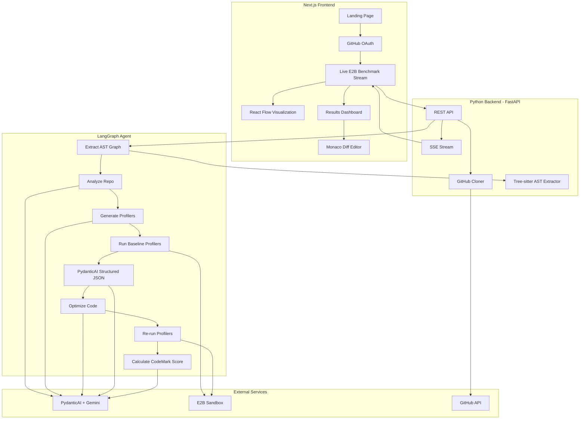
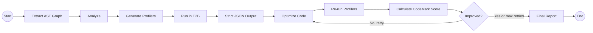

# Performance Optimizer - Hackathon Project Plan

## Architecture Overview




## Tech Stack and Libraries

- **Frontend**: Next.js 14 (App Router), Tailwind CSS, shadcn/ui
  - **Visualization**: React Flow (performance graph), `recharts` (radar/spider charts, live telemetry metrics)
  - **Animations**: `framer-motion` (smooth transitions, score count-up animations)
  - **Code Diff**: `@monaco-editor/react` (professional side-by-side before/after code comparison)
- **Backend**: Python, FastAPI, LangGraph, `google-genai` SDK
  - **Structured Output**: PydanticAI agents inside each LangGraph node to enforce validated Pydantic schemas on all Gemini responses. Handles retries and validation errors automatically.
  - **Code Parsing**: Tree-sitter (`tree-sitter`, `tree-sitter-python`, `tree-sitter-javascript`, `tree-sitter-typescript`) for deterministic AST extraction and dependency graph building
- **Code Execution**: E2B sandboxes pre-configured with robust profilers (`pyinstrument` for Python, `clinic.js` for JS/TS)
- **Auth**: NextAuth.js with GitHub OAuth provider
- **Real-time Updates**: Server-Sent Events (SSE) from FastAPI to frontend
- **Repo Handling**: GitHub REST API via PyGithub + git clone

## Directory Structure

```text
genai-genisis/
  frontend/              # Next.js app
    src/
      app/
        page.tsx           # Landing page
        dashboard/
          page.tsx         # Main dashboard (Live Stream + Score Dash)
        api/
          auth/[...nextauth]/route.ts  # NextAuth GitHub OAuth
      components/
        repo-input.tsx         # GitHub URL input form
        live-telemetry.tsx     # Real-time E2B terminal and phase indicators
        performance-graph.tsx  # React Flow visualization
        score-dashboard.tsx    # CodeMark score and radar charts
        comparison-view.tsx    # Monaco Diff Editor
      lib/
        api.ts                 # Backend API client
  backend/               # Python FastAPI
    main.py              # FastAPI app, routes, SSE endpoint
    agent/
      graph.py           # LangGraph agent definition
      state.py           # Agent state TypedDict
      schemas.py         # Pydantic output schemas for all nodes
      nodes/
        analyzer.py      # Analyze repo structure using AST parser + Gemini
        benchmarker.py   # Generate profiling scripts
        runner.py        # Execute profilers in E2B
        visualizer.py    # Enforce PydanticAI schema for graph data
        optimizer.py     # Generate optimized code via Gemini
        reporter.py      # Calculate CodeMark Score and compile comparison data
    services/
      github_service.py  # Clone repos, read files, create branches
      e2b_service.py     # E2B sandbox + pyinstrument/clinic.js setup
      gemini_service.py  # Gemini API wrapper
      parser_service.py  # Tree-sitter AST extraction
    requirements.txt
  docker-compose.yml     # Single command to run both frontend + backend
  .env.example           # Documented env vars (GOOGLE_API_KEY, E2B_API_KEY, GITHUB_*)
```

## LangGraph Agent Design

The agent follows a sequential pipeline with a conditional optimization loop. For advanced usage, the graph can use LangGraph's `Send` API to fan-out and run parallel sub-graphs when multiple independent bottlenecks are found.




**Agent State** (shared across all nodes):

- `repo_url`, `repo_path` (cloned location)
- `file_tree` (structure of the repo)
- `ast_map` (deterministic JSON of functions, classes, imports, and call edges via tree-sitter)
- `analysis` (Gemini's higher-level analysis: hotspot candidates, bottleneck reasoning)
- `benchmark_code` (generated profiling scripts)
- `initial_results` (flamegraph / raw profiling JSON from E2B + CPU/Mem telemetry)
- `graph_data` (strictly validated nodes + edges for React Flow visualization)
- `optimized_files` (dict of filepath -> optimized content)
- `final_results` (profiling JSON + telemetry after optimization)
- `comparison` (structured before/after delta + calculated CodeMark score)
- `messages` (progress messages streamed to frontend via SSE)

**Pydantic Output Schemas** (defined in `backend/agent/schemas.py`, enforced via PydanticAI):

- `ASTData` - Tree-sitter output: list of functions/classes with file, line, name, params, and call edges
- `AnalysisResult` - Gemini analysis: list of hotspots with reasoning, severity, category
- `BenchmarkScript` - Generated profiling code with target function, language, script content
- `BenchmarkResult` - Execution results: function name, avg time, memory, iterations, profiling JSON
- `GraphData` - React Flow compatible: list of nodes (id, label, metrics, position) and edges (source, target, label)
- `OptimizationPlan` - Per-file changes: filepath, original snippet, optimized snippet, explanation, expected improvement
- `CodeMarkScore` - Composite score from time, memory, and structural improvements + per-axis radar chart data
- `ComparisonReport` - Before/after per function: name, old time, new time, speedup factor, summary, CodeMark delta

Each LangGraph node wraps its Gemini call in a PydanticAI agent configured with the appropriate output schema. PydanticAI validates the response, retries on malformed output, and returns a typed Pydantic model that downstream nodes can rely on.

**Node Details**:

1. **AST Parser** - Pre-processes the codebase using tree-sitter to deterministically extract function names, class definitions, call relationships, imports, and dependency edges. Guarantees no hallucinated file paths or function names in downstream nodes.
2. **Analyzer** - Feeds the AST map alongside the raw code into Gemini (via PydanticAI -> `AnalysisResult`) to identify likely performance bottlenecks (N+1 queries, blocking I/O, inefficient algorithms, O(n^2) loops, etc.).
3. **Benchmark Generator** - Gemini (via PydanticAI -> `BenchmarkScript`) generates profiling scripts targeting the identified hotspots using standard profiling libraries (`pyinstrument` for Python, `clinic.js`/`0x` for JS/TS). The tree-sitter call graph ensures benchmarks target real functions with correct signatures.
4. **Benchmark Runner** - Executes the profilers inside an E2B sandbox, capturing rich profiling JSON, stdout data, and live CPU/Memory telemetry streamed to the frontend.
5. **Visualizer** - Uses PydanticAI to force Gemini to transform the AST map and profiling results into 100% valid React Flow `GraphData` (nodes = modules/functions, edges = call relationships, node color/size = performance metrics).
6. **Optimizer** - Gemini 2.5 Pro (via PydanticAI -> `OptimizationPlan`) rewrites the bottleneck code with optimizations (algorithm improvements, async I/O, batch API calls, caching, compiler hints). Receives exact function code from tree-sitter for precise rewrites.
7. **Re-runner** - Runs the identical profilers on the optimized code in E2B.
8. **Reporter (The Scorer)** - Acts as the "Benchmark Judge." Computes deltas and blends execution time, memory usage, and structural improvements into a **CodeMark Score**. Generates the final Recharts spider-chart data via PydanticAI -> `CodeMarkScore`.

*Advanced: Parallel Execution Pattern* -- If the analyzer finds multiple independent bottlenecks (e.g., one in the DB layer, one in the UI rendering), the graph can use LangGraph's `Send` API to fan-out and run GenBench -> RunBench -> Optimize -> ReRun in parallel sub-graphs before fanning-in at the Reporter node.

## Frontend Key Screens

The UI follows a clean, professional aesthetic inspired by 3DMark's benchmarking tool -- dark theme, structured data panels, crisp typography, and clear data hierarchy. No gaming/neon styling. Think professional developer tooling (like Vercel's dashboard or Datadog) with the structured scoring concept from 3DMark.

### 1. Landing Page

- Clean hero section explaining the tool's value proposition.
- "Sign in with GitHub" button (NextAuth).
- Brief overview of the analysis pipeline.

### 2. The Live Benchmark View (Real-time E2B Stream)

During analysis and benchmarking, the dashboard shows live progress:

- **Live Console Feed**: An auto-scrolling terminal panel streaming stdout/stderr from the E2B sandbox via SSE. Clean monospace font, subtle background.
- **Live Telemetry**: Real-time line charts (Recharts) showing CPU load and Memory usage inside the E2B sandbox as the benchmark executes.
- **Phase Indicators**: A clean horizontal stepper/progress bar showing current agent status: Analyzing Codebase -> Running Baseline -> Optimizing Code -> Running Optimized Benchmark -> Scoring.

### 3. The React Flow Hotspot Visualization

- As the agent analyzes the code, a React Flow graph builds on screen. Each node is a module/function, edges are call relationships.
- After the baseline run, nodes color-code based on profiling results. Red nodes indicate bottlenecks (e.g., `fetchUserData()` at 4.2s), green indicates fast paths. Clicking a node opens a detail panel with timing breakdown.

### 4. Results Dashboard (3DMark-Inspired Layout)

When the final re-run completes, the UI transitions to a structured results screen:

- **CodeMark Score**: A prominent composite score (e.g., 8,450 -> 14,200) calculated from execution time, memory, and structural complexity. Uses `framer-motion` for a smooth count-up animation.
- **Before vs. After Radar Chart**: A Recharts radar chart with axes like I/O Speed, CPU Efficiency, Memory Footprint, and Concurrency. "Before" and "After" overlaid as two polygons.
- **Granular Metrics Cards**: Clean stat cards with:
  - Execution Time: `4.5s` -> `0.8s` (+82% Speedup)
  - Memory Peak: `145 MB` -> `82 MB` (-43% RAM Usage)
  - Time Complexity Estimate: `O(n^2)` -> `O(n log n)`
- **Monaco Diff Editor**: A side-by-side syntax-highlighted diff view showing exactly what the AI changed.
- **Benchmark Environment**: A subtle footer showing the E2B sandbox specs (e.g., E2B vCPU x4, 8GB RAM, Python 3.11) for benchmark reproducibility.

## API Endpoints (FastAPI)

- `POST /api/analyze` - accepts `{ repo_url, github_token }`, kicks off the LangGraph agent, returns a `job_id`
- `GET /api/stream/{job_id}` - SSE endpoint streaming real-time telemetry, terminal logs, and agent progress
- `GET /api/results/{job_id}` - fetch final CodeMark Score, spider chart data, graph data, and optimized files

## Key Implementation Notes

- **GitHub OAuth flow**: NextAuth handles the OAuth on the frontend; the access token is forwarded to the backend so it can clone private repos.
- **Deterministic Graphing**: Relying purely on Gemini to draw dependency graphs causes hallucinated file paths. Tree-sitter guarantees React Flow edges actually exist in the codebase. The `parser_service.py` parses every `.py`, `.js`, and `.ts` file to extract functions, classes, call graphs, and imports.
- **PydanticAI pattern**: Each LangGraph node creates a PydanticAI `Agent` with `model='google-gla:gemini-2.5-pro'` and `output_type=<PydanticSchema>`. The agent handles prompt construction, Gemini API calls, JSON parsing, Pydantic validation, and automatic retries. This eliminates manual JSON parsing and prevents frontend crashes from bad LLM output.
- **E2B Sandbox**: Each benchmark run spins up a fresh E2B sandbox pre-loaded with profiling tools (`pyinstrument`, `clinic.js`). The repo code + profiling scripts are uploaded, executed, and JSON results/telemetry are streamed back securely.
- **Streaming UX**: SSE is simpler than WebSockets for this uni-directional update pattern. Each LangGraph node emits status messages and telemetry that flow through FastAPI's SSE endpoint to power the live dashboard.
- **Supported languages**: Python and JavaScript/TypeScript. Tree-sitter detects the language from file extensions and uses the appropriate grammar.
- **Gemini model**: Use `gemini-2.5-pro` for the complex analysis/optimization PydanticAI agents (good at code understanding and structured output), and `gemini-2.0-flash` for lighter tasks like status summaries.

## Production Readiness (Bitdeer Prize Track)

This project targets the **Bitdeer "Beyond the Prototype: Best Production-Ready AI Tool"** track. The judges are looking for "technical depth," "practical utility," and "the most polished and technically ambitious solution." The following production-quality practices differentiate this from a typical hackathon prototype:

**Frontend polish:**

- Error boundaries around every major component (graph, telemetry, diff editor) so one failure doesn't crash the app
- Loading skeletons (not spinners) for every async state using shadcn/ui Skeleton components
- Input validation on repo URL (regex for valid GitHub URLs, feedback on invalid input)
- Responsive layout that works on laptop screens and external monitors
- Toast notifications (sonner) for non-blocking error/success feedback
- Empty states with clear CTAs when no analysis has been run yet

**Backend robustness:**

- Structured logging with `structlog` -- every agent node logs its inputs, outputs, and timing
- Graceful error handling in every LangGraph node -- if one node fails, the agent returns partial results with a clear error message rather than crashing silently
- Request validation with Pydantic models on all API endpoints
- Rate limiting on `/api/analyze` to prevent abuse
- Timeout handling on E2B sandbox execution (kill runaway benchmarks after 60s)
- CORS properly configured for the frontend origin only

**Developer experience:**

- Single `docker-compose up` to run both frontend and backend locally
- `.env.example` file documenting every required environment variable
- Clear README with setup instructions, architecture diagram, and demo screenshots
