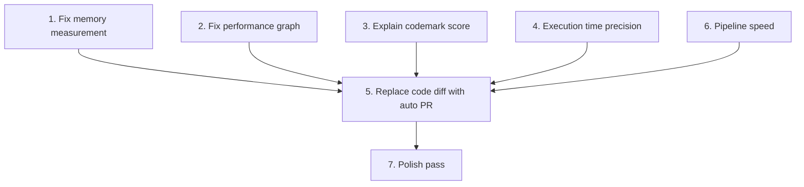

# CodeMark Issues Roadmap

## Priority Order and Dependency Map




Issues 1-4 and 6 are independent of each other and can be parallelized. Issue 5 (auto PR) depends on memory being correct and the graph being clean so the PR description/results are trustworthy. Issue 7 is a final polish pass.

---

## 1. Fix memory measurement (broken)

**Problem:** Memory always shows 0 MB. The benchmark prompt in [benchmarker.py](backend/agent/nodes/benchmarker.py) tells Gemini to "measure execution time and memory" but gives no concrete instructions on *how*. The generated scripts rarely import `memory_profiler` or call `tracemalloc`. The Modal image installs `memory_profiler` and `pyinstrument` but nothing enforces their use. JS benchmarks have zero memory instructions.

**Root cause chain:**

- `benchmarker.py` prompt (line 14): vague "measure execution time and memory"
- `modal_service.py` (line 9-11): installs `memory_profiler` but runner just calls `subprocess.run(["python", script_path])` — no `-m memory_profiler` wrapper
- `runner.py` (line 51): parses `memory_peak_mb` from stdout, which is 0 when the script doesn't measure it

**Fix:**

- **Option A (deterministic, recommended):** Inject a memory measurement wrapper into the benchmark scripts at execution time in `_run_python_benchmark`. Before running the script, prepend `tracemalloc.start()` at the top and append a `tracemalloc.get_traced_memory()` reporter that patches the JSON output with `memory_peak_mb`. This removes the dependency on Gemini generating correct measurement code.
- **Option B (prompt-only):** Rewrite the benchmark prompt to include explicit boilerplate showing exactly how to use `tracemalloc` or `memory_profiler`. Less reliable since the model can still deviate.
- For JS: use `process.memoryUsage().heapUsed` — add explicit instructions or inject a wrapper similarly.

**Files:**

- `backend/services/modal_service.py` — wrap benchmark scripts with memory instrumentation
- `backend/agent/nodes/benchmarker.py` — strengthen the prompt with explicit measurement code
- `backend/agent/nodes/runner.py` — ensure `memory_peak_mb` is parsed from the injected wrapper output

---

## 2. Fix performance graph (random line, looks scuffed)

**Problem:** The React Flow graph has a "random line" and looks messy. Two causes:

1. **Stray edges:** Gemini sometimes generates edges referencing node IDs that don't exist, or duplicate edges. React Flow renders these as lines to/from (0,0) — the "random line."
2. **Bad layout:** Node positions are entirely LLM-generated (`position_x`, `position_y` in the prompt). The model often clusters nodes or overlaps them.

**Fix:**

- **Frontend — filter invalid edges:** In [performance-graph.tsx](frontend/src/components/performance-graph.tsx) (line 78-89), filter edges to only those where both `source` and `target` exist in the node set. This eliminates the random line immediately.
- **Frontend — auto-layout:** Replace LLM-generated positions with a proper layout algorithm. Use `dagre` (standard for directed graph layout) to compute node positions client-side after receiving the data. Remove `position_x`/`position_y` from the Gemini prompt entirely.
- **Backend — simplify visualizer prompt:** In [visualizer.py](backend/agent/nodes/visualizer.py), remove the position-related instructions since layout is now handled client-side. This also makes the Gemini call faster and less error-prone.

**Files:**

- `frontend/src/components/performance-graph.tsx` — add edge filtering + dagre layout
- `frontend/package.json` — add `@dagrejs/dagre` dependency
- `backend/agent/nodes/visualizer.py` — remove position instructions from prompt
- `backend/agent/schemas.py` — make `position_x`/`position_y` optional or remove

---

## 3. Explain what CodeMark score means

**Problem:** The score card in [score-dashboard.tsx](frontend/src/components/score-dashboard.tsx) (lines 87-116) shows "CodeMark Score" with before/after numbers but zero explanation of the scale, what the number means, or how it's composed.

**Fix:**

- Add a collapsible explanation panel or tooltip below the score card explaining:
  - Scale: 0-20,000 (baseline unoptimized project: ~5,000-8,000)
  - Composition: 40% time score, 30% memory score, 30% complexity score
  - What each sub-score reflects
- Show the three sub-scores (time, memory, complexity) as small labeled bars or chips below the main score. The data already exists in `codemark_score.time_score`, `memory_score`, `complexity_score` — it's just not rendered.

**Files:**

- `frontend/src/components/score-dashboard.tsx` — add explanation UI and sub-score breakdown

---

## 4. Execution time — more significant figures

**Problem:** All timing values use `.toFixed(1)` (1 decimal place). For fast functions (sub-millisecond), this shows `0.0ms` which is useless.

**Fix:**

- Create a smart formatter function: if value >= 100, show 0 decimals; if >= 1, show 2 decimals; if >= 0.01, show 3 decimals; if < 0.01, show in microseconds.
- Apply it in:
  - `score-dashboard.tsx` lines 171, 172, 231, 234 (metric cards + table)
  - `performance-graph.tsx` line 57 (graph nodes)

**Files:**

- `frontend/src/lib/format.ts` (new utility) — smart time formatter
- `frontend/src/components/score-dashboard.tsx` — use formatter
- `frontend/src/components/performance-graph.tsx` — use formatter

---

## 5. Replace code diff with auto PR + link

**Problem:** The "Code Diff" tab shows a Monaco diff editor. The user wants this replaced with automatic PR creation and a link to the PR.

**Depends on:** Issues 1-2 fixed (memory + graph should be correct before results go into a PR description).

**Fix — Backend:**

- Add a new service `backend/services/github_pr_service.py` that:
  - Accepts the repo URL, github token, optimized files, and comparison report
  - Creates a new branch (`codemark/optimize-{timestamp}`)
  - Commits the optimized file contents
  - Opens a PR via the GitHub API with a body summarizing the CodeMark results (score improvement, per-function breakdown, optimization explanations)
  - Returns the PR URL
- Add a new graph node `create_pr_node` between `report` and `cleanup` in [graph.py](backend/agent/graph.py)
- Include the PR URL in the pipeline result dict

**Fix — Frontend:**

- Replace the `ComparisonView` component (or the "Code Diff" tab) with a "Pull Request" tab that shows:
  - A "Create PR" button (if PR hasn't been created yet) or the PR link
  - PR title, description preview, list of changed files
  - Link opens in new tab to GitHub

**Files:**

- `backend/services/github_pr_service.py` (new) — branch creation, commit, PR via GitHub API
- `backend/agent/graph.py` — add `create_pr_node` to the pipeline
- `backend/agent/state.py` — add `pr_url: str` field
- `backend/main.py` — include `pr_url` in results
- `frontend/src/components/comparison-view.tsx` — replace with PR view
- `frontend/src/lib/api.ts` — add `pr_url` to result types
- `frontend/src/app/dashboard/page.tsx` — update tab label and content

---

## 6. Pipeline takes too long

**Problem:** The pipeline runs 10 nodes sequentially, 4 of which are Gemini API calls (analyze, generate_benchmarks, visualize, optimize) and 2 are Modal sandbox runs. With retries, this can easily exceed 2-3 minutes.

**Fix (ordered by impact):**

- **Parallelize independent nodes:** `visualize` and `optimize` both only depend on `initial_results` + `ast_map`/`analysis` — they don't depend on each other. Run them in parallel by restructuring the graph in [graph.py](backend/agent/graph.py):

```
  run_benchmarks -> [visualize, optimize] (parallel) -> rerun_benchmarks
  

```

  LangGraph supports this natively via fan-out edges.

- **Switch `visualize` to Gemini Flash:** In [visualizer.py](backend/agent/nodes/visualizer.py) line 37, it uses `GEMINI_PRO`. Graph layout is not a complex reasoning task — Flash is sufficient and ~3-5x faster.
- **Parallelize benchmark execution:** In [runner.py](backend/agent/nodes/runner.py) lines 28-79, benchmarks run sequentially (`for bench in benchmarks`). Use `asyncio.gather` to run them concurrently since each is an independent Modal sandbox.
- **Shallow clone is already in place** (depth=1) so no change needed there.

**Files:**

- `backend/agent/graph.py` — restructure edges for parallel visualize+optimize
- `backend/agent/nodes/visualizer.py` — switch to `GEMINI_FLASH`
- `backend/agent/nodes/runner.py` — parallelize benchmark runs with `asyncio.gather`

---

## 7. Final polish pass

After all the above, do a full end-to-end test run and address any remaining UI/UX rough edges (spacing, loading states for the new PR tab, edge cases with 0-value metrics, etc.).